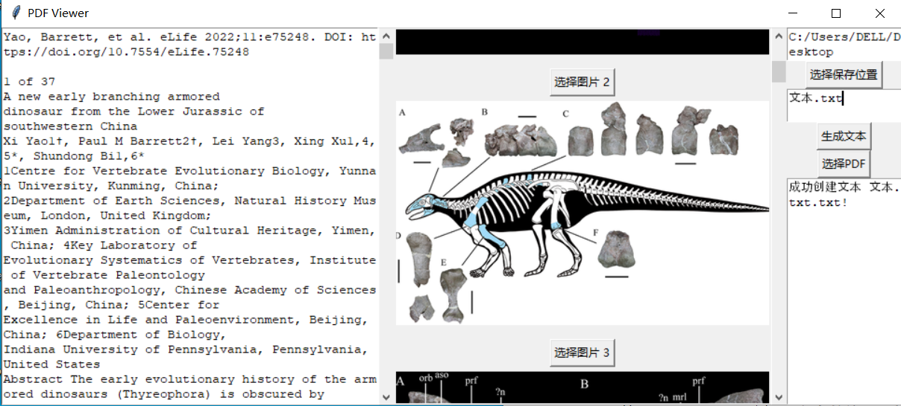
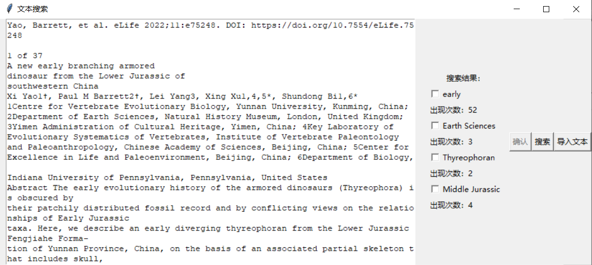

# 			Database Pipelining Tool

---

尝试使用程序处理在提取文献中的数据信息时遇到的重复性工作，提高搜集文献的效率

---

上图为程序的主界面，主要分为**数据处理**，**图像处理**和**属性查询**三个方面的内容

##### 数据处理

目前已经建成许多数据库（比如: **PBDB**), 但是从数据库中获得的数据的质量不容易得到保证。该部分的功能意在提高数据清洗的速度，将数据库的数据形式转化为研究需要的形式。

###### **PBDB数据形式**

###### **清洗后的形式**

---

##### 图像处理

能够导入图片，利用比例关系的原理，直接获取恐龙模型的头长和体长，大大加快了测量速度

针对不同的图片内容深入开发了三种不同的测量模式，经过实测，可将原来十几分钟的测量时间缩短至20秒内

---

##### 属性查询

界面如下图：

该模块能够将论文pdf进行导入，分别获取**论文的文本**和**论文中的图片**, 通过点击选择图片上方的按钮可以下载需要处理的图片内容；通过选择**保存的位置**和**文本的名称**，可以将文本进行**保存**

---

##### 文本搜索

界面如下图：

由于查找数据最后获取的内容多为**固定的单个名词**，而一篇文章的主要研究对象的相关属性一般会以**数量最多次**存在，所以开发了该应用可以实现自主查找规定的属性内容，提高阅读速度。

通过点选可以直接将需要的信息录入，大大节省了时间。

---

##### PDF论文信息提取

该模块正在建设，意图可以直接将需要查阅的pdf文件放入指定文件夹内，便可以自主的获取到相关的信息，优化后汇总入excel文件中。

能够获取论文中的excel表格，测试的表格的内容如下：

测试结果：

-----

未来将会采用新的方法手段，进一步完善相关模块的功能